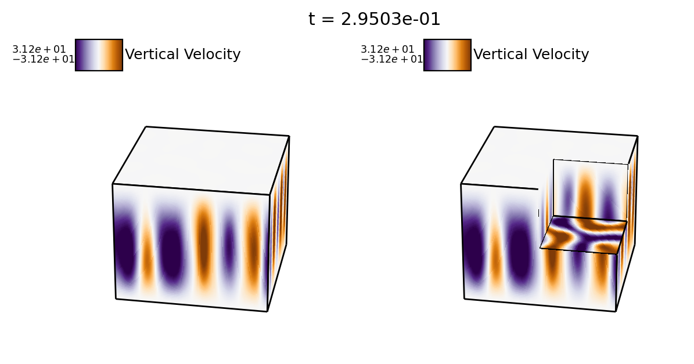

# 3D Rayleigh Benard Convection

This example problem was lifted directly from the dedalus version 2 repository. 

First run the simulation:

```sh
python rayleigh_benard.py
```

Then you can make two types of volume plots below (set up in collaboration with Imogen Cresswell -- thanks, Immie!)

# 3D matplotlib volumes (slow but portable)

Plotpal can plot volume renderings of boxes using the matplotlib engine: 

```sh
python3 plot_box.py
```

Producing images like this one:



# 3D pyvista volumes (fast, might not work on all clusters)

Plotpal can also plot volume renderings of boxes using the pyvista engine, which is ~10x faster than the matplotlib one: 

```sh
python3 plot_pyvista_box.py
```

Producing images like this one:


