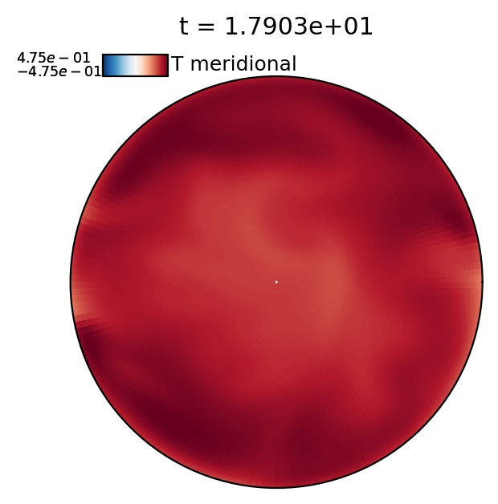

# 3D Ball Internally Heated Convection

This example problem is lifted directly from the dedalus repository. First run the simulation:

```sh
python internally_heated_convection.py
```

Then the types of plots you can make with plotpal are shown below:

# 3D Volume plots

Plotpal can plot movies of 3D volume renderings using phyvista: 

```sh
python3 plot_pyvista_sphere.py
```

Producing images like this one:


# 2D slice plots

Plotpal can plot various kinds of 2D slices in spherical coordinates. Cuts through the equator:

```sh
python3 plot_equatorial_slices.py
```

Produce images like this one:


Cuts through meridians:

```sh
python plot_meridional_slices.py
```

Producing images like this one (it's not very interesting for this case, but is cool for rotating cases!):



Surface plots can be made in Mollweide projectsion:

```sh
python plot_mollweide_slices.py
```

Producing images like this one:


Surface plots can also be made in Orthographic projections:

```sh
python plot_orthographic_slices.py
```

Producing images like this one:


# 1D Profiles

Plotpal can plot a few 1D profiles that have been averaged over time from dedalus simulations:

```sh
python3 plot_avg_structure.py
```

Producing images like this one:


Plotpal can also plot a rolling average of profiles to make a smooth movie of time evolution

```sh
python3 plot_rolled_structure.py
```

Producing less images like this one:


