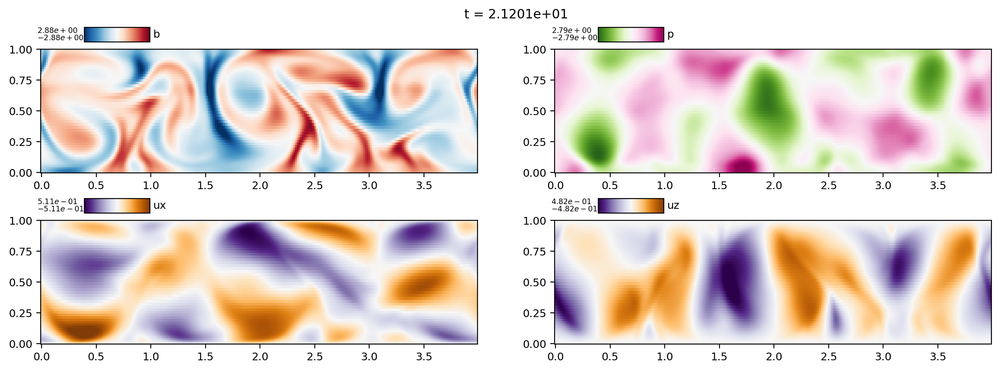
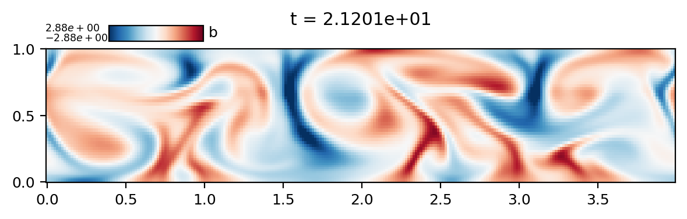
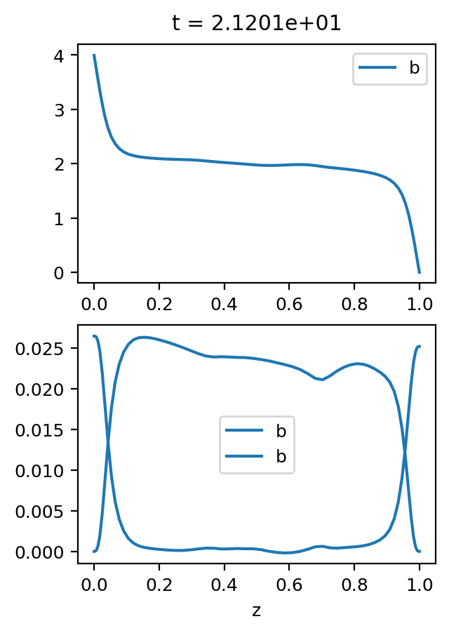
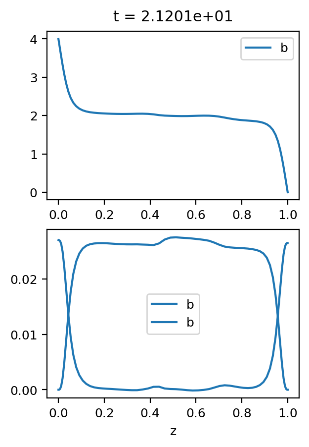
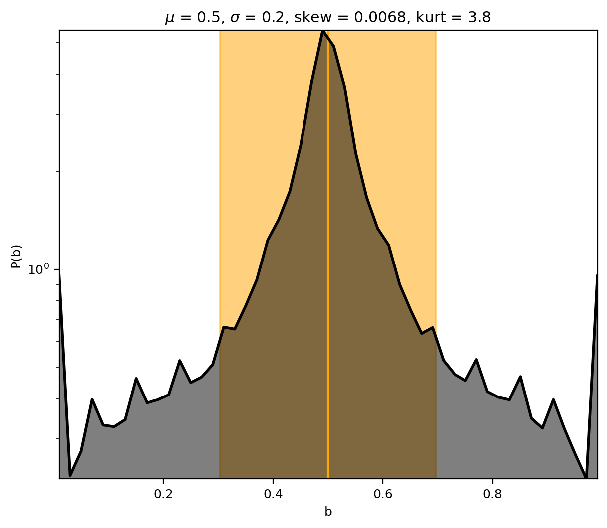

# 2D Rayleigh Benard Convection

This example problem is lifted directly from the dedalus repository. The types of plots you can make with plotpal are shown below:

# 2D slices

Plotpal can plot movies of 2D slices including multiple frames, using e.g., 

```sh
python3 plot_all_slices.py
```

Producing images like this one:



Plotpal can also just do a movie of a single field if you want something less cluttered:

```sh
python3 plot_b_slices.py
```

Producing images like this one:



# 1D Profiles

Plotpal can plot instantaneous 1D profiles from dedalus simulations:

```sh
python3 plot_instantaneous_profiles.py
```

Producing images like this one:



Plotpal can also plot a rolling average of profiles:

```sh
python3 plot_rolled_profiles.py
```

Producing less jittery images like this one:



# PDFs

Plotpal can plot the PDFs of 2D flow fields:

```sh
python3 plot_b_pdf.py
```

Producing an image like this one:



# Scalar Traces

Plotpal can plot the evolution over time of scalar outputs:

```sh
python3 plot_scalar_traces.py
```

Producing images like the one below:

